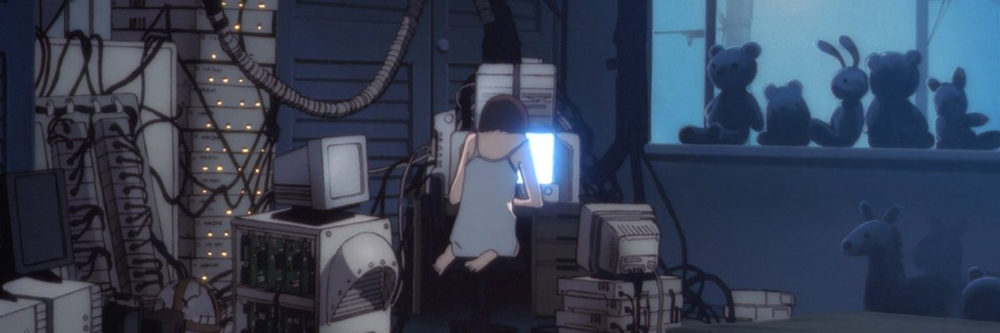

<!-- Profile -->

## 

 <!-- About Me -->

💬 **Me**: I am Najwa aka 0xnotkyo, a red teamer, pentester with a passion for cybersecurity & ethical hacking.

#### Social:
- [Twitter](https://x.com/0xnotkyo)

 <!--horizontal divider(gradiant)-->

 
 <!-- Gif -->

 

    

###

 <!-- Blog -->
 
📝 **Blog**: I'm currently documenting my progress with cybersecurity and ethical hacking on my blog, which you can find [here](https://0xnotkyo.gitbook.io/notes/).

 <!-- Skills and Tools -->

 ## `🖥️` Skills and Tools:

 <!-- Github Stats-->
 
## `🖥️` GitHub Stats

  
  

<!-- Snake animation -->

