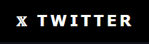

<!-- Profile -->

    <samp>
        <b>Hello World!👋 <a href="https://najw4h.github.io/najw4h/" target="_blank">I'm najwah!</a></b>
        
         
        
<b>I am Najwa, a red teamer, pentester with a passion for cybersecurity & ethical hacking.</b>

        
         
        <b>
        
<b>~ Yours Truly ~</b>

    </samp>

<!--horizontal divider(gradiant)-->

<!-- About me -->

    
    
    
    
    

    

    

